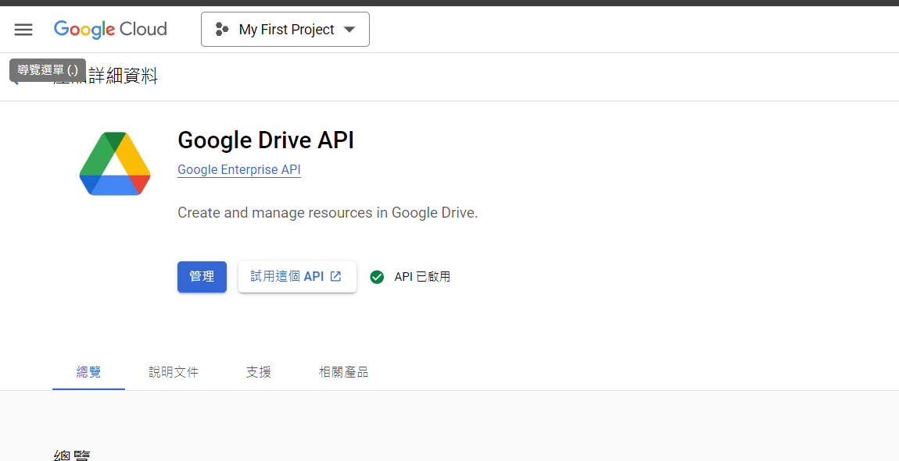
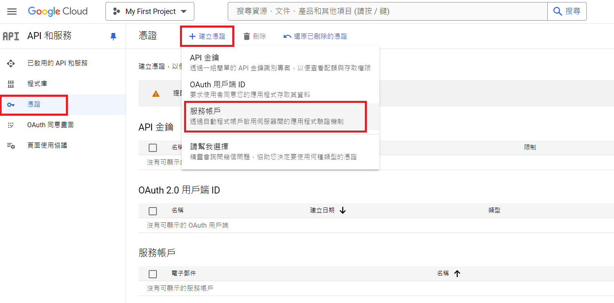
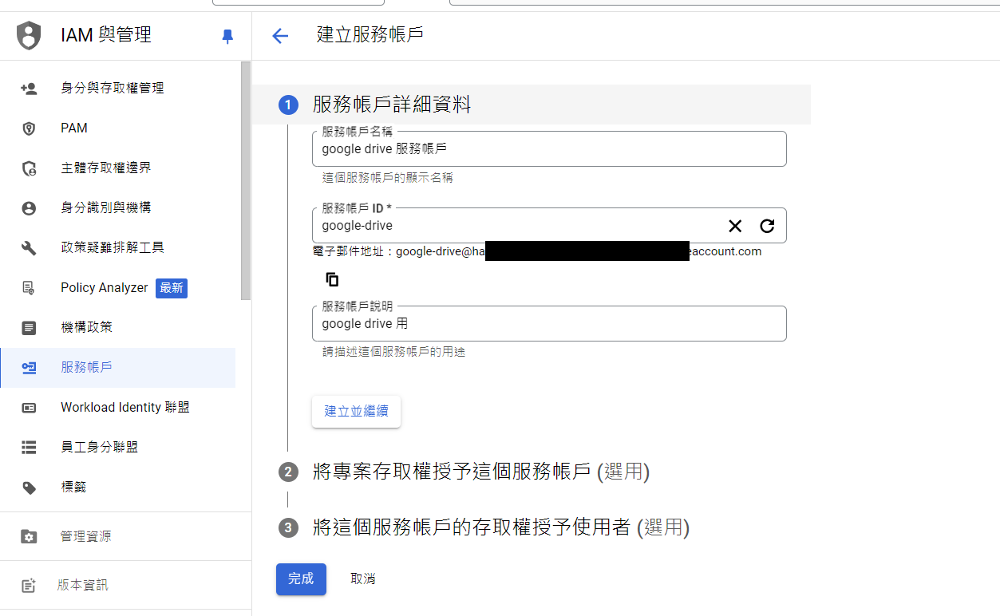
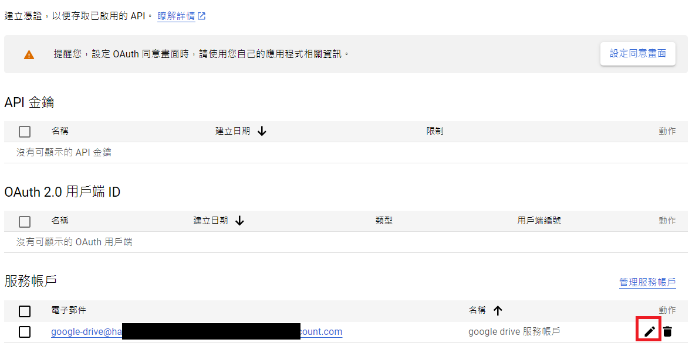
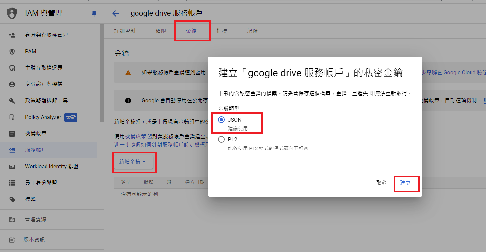
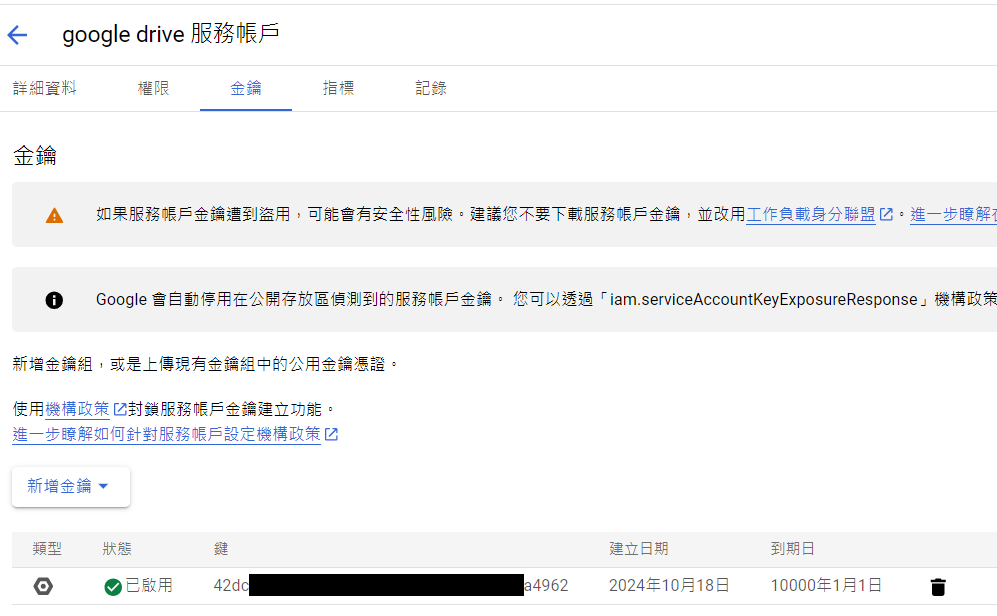
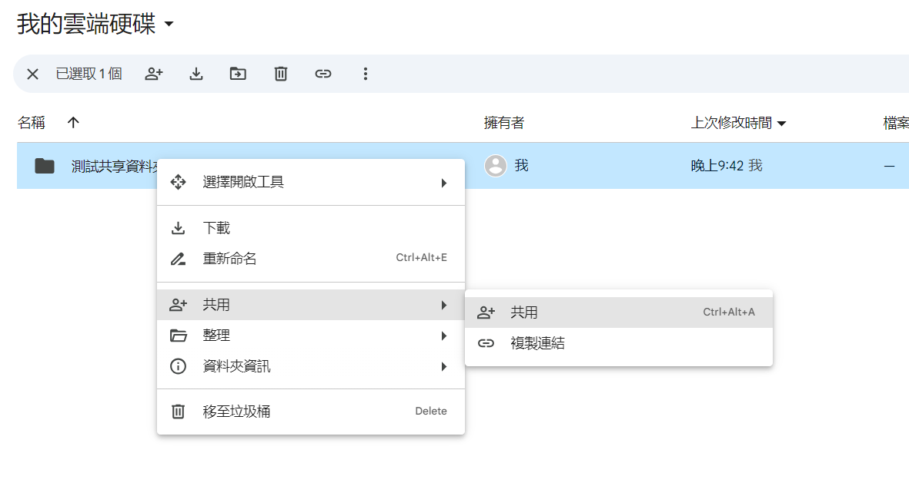
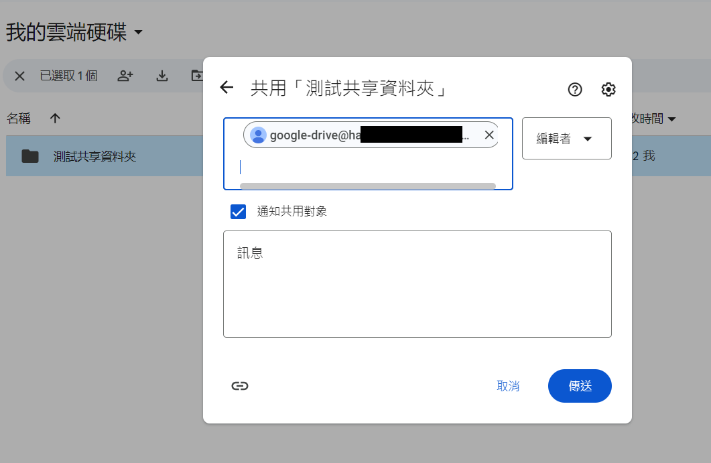
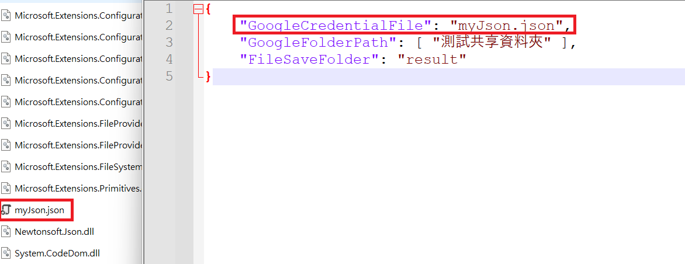

# GoogleDriveConsole

- 背景：有需要在特定公用電腦使用公用 Google 帳號透過 GoogleDrive 交換檔案，但每次都需要經過登入、輸入帳密、找檔案、下載等一連串手動操作。故使用服務帳戶金鑰 JSON 檔認證，不用登入或是 OAuth 驗證即可達到下載 GoogleDrive 檔案的目的

- 此為簡易的 GoogleDrive 檔案下載工具，用於自動下載特定資料夾內的所有檔案

# GoogleCloud

- 先到 [GoogleCloud](https://console.cloud.google.com/) 選取或是建立專案，之後如果找不到 GoogleDriveApi 啟動頁面可以在上方搜尋 "Google Drive API"，進入後即可開始以下設定步驟

## 1. 啟用 GoogleDriveApi


## 2. 建立服務帳戶 - 1


## 3. 建立服務帳戶 - 2


## 4. 服務帳戶建立完成


## 5. 產生金鑰 JSON 檔並下載


## 6. 金鑰產生完成


## 7. 設置 GoogleDrive 資料夾給服務帳戶 - 1


## 8. 設置 GoogleDrive 資料夾給服務帳戶 - 2


## 9. 放置一些測試檔案


## 10. 金鑰 JSON 檔案放到本機執行路徑


## 11. 路徑設定
- 如果下載 GoogleDrive 路徑為 `測試共享資料夾/aaa/bbb` 資料夾的檔案，設定為：
```json
"GoogleFolderPath": [ "測試共享資料夾", "aaa", "bbb" ]
```