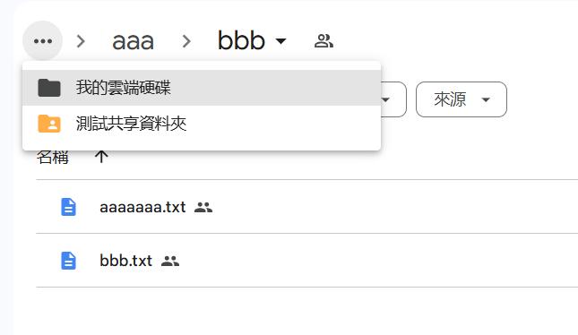

# 專案名稱

GoogleDriveConsole 使用服務帳戶金鑰json檔認證，不用登入公用帳號即可下載GoogleDrive檔案

# GoogleCloud

[GoogleCloud](https://console.cloud.google.com/)

## 截圖

- 啟用GoogleDriveApi

- 建立服務帳戶1

- 建立服務帳戶2

- 服務帳戶建立完成

- 產生金鑰json並下載

- 金鑰產生完成

- 設置GoogleDrive資料夾給服務帳戶1

- 設置GoogleDrive資料夾給服務帳戶2

- 測試檔案

- 金鑰json放到本機執行路徑

